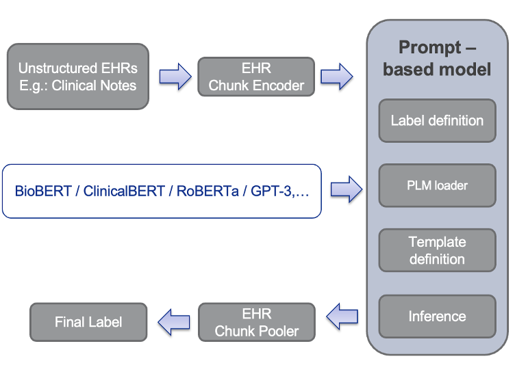

# HealthPrompt
Prompt Learning is a new paradigm in Natural Language Processing(NLP), which uses pre-trained language models to perform downstream tasks, avoiding fine tuning of a model. This zero-shot learning approach can be applied to healthcare applications, where there is limited availability of data. This projects aims to design prompt methodologies for downstream applications using PLMs, without the need for model training. This approach can change "Deep Learning" to "Deep Thinking" in Healthcare sector.

## Architecture

<div align="center">



</div>

## Citation
Please cite our paper

```bibtex
@article{sivarajkumar2022healthprompt,
  title={HealthPrompt: A Zero-shot Learning Paradigm for Clinical Natural Language Processing},
  author={Sivarajkumar, Sonish and Wang, Yanshan},
  journal={arXiv preprint arXiv:2203.05061},
  year={2022}
}
```
## Development

[`HealthPrompt`][HealthPrompt] is developed by [Sonish Sivarajkumar][sonish] and [Dr.
Yanshan Wang][drwang].

## Implementation

[`HealthPrompt`][HealthPrompt] is implemented by [Sonish Sivarajkumar][sonish].

[sonish]: https://sonishsivarajkumar.github.io/homepage/
[drwang]: https://sites.pitt.edu/~yaw89/
[HealthPrompt]: https://github.com/PittNAIL/HealthPrompt
